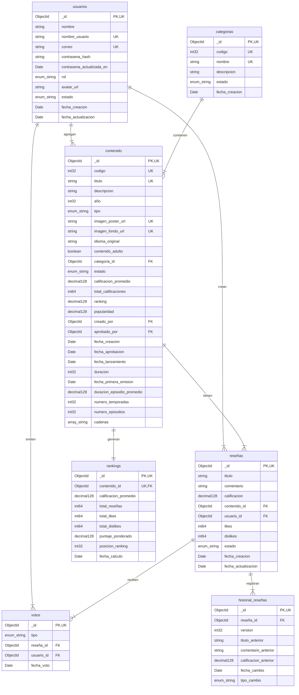
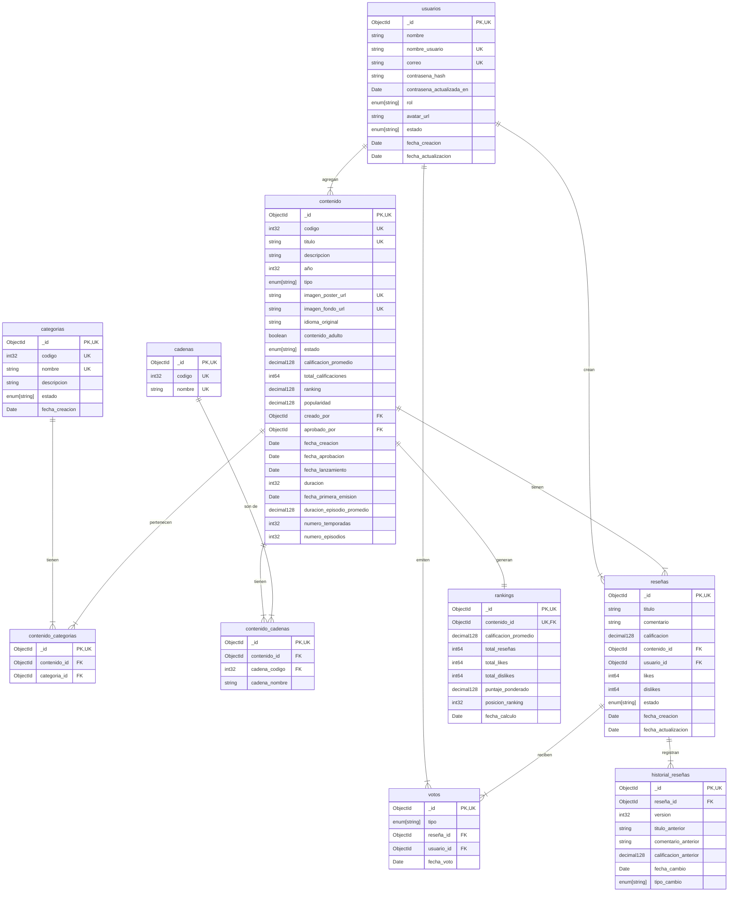
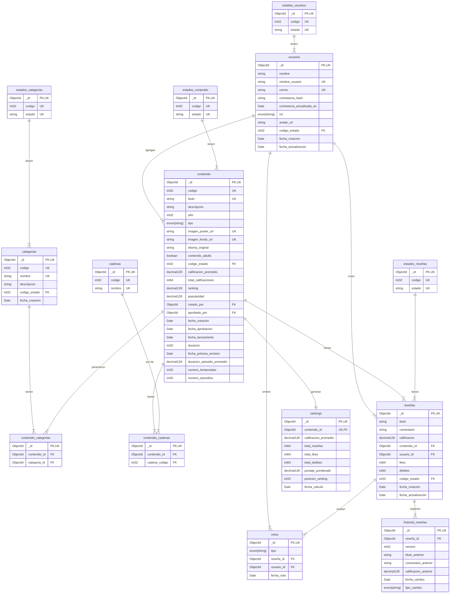
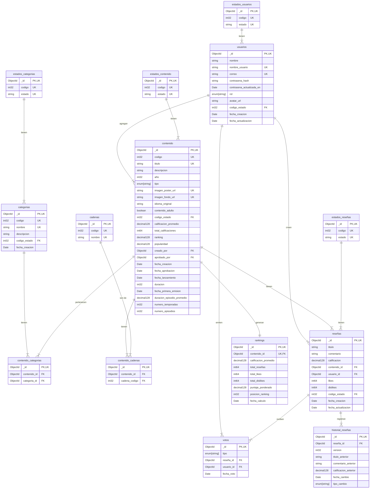

<h1 align="center";>

**Sistema de Información**

</h1>

## Introducción

Este documento servirá como una guía detallada del proceso completo de *diseño*, *estructuración* e *implementación* de una *base de datos* para **Movie Website KarenFlix**. El objetivo principal es gestionar eficazmente los datos e información generados por los *clientes*, *proyectos*, *propuestas*, *contratos*, *entregables* y *gestión financiera*. Inicialmente, se analizará el caso de estudio junto con sus requerimientos específicos. A partir de esta investigación, se procederá a desarrollar un *modelo conceptual* detallado donde se identificarán las entidades principales, sus atributos y las relaciones entre ellas. Este paso determina las bases para comprender la estructura esencial de la gestión del **Movie Website KarenFlix**.

A continuación, se realizará la conversión del *modelo conceptual* al *modelo lógico*. Este último ofrece una representación más precisa de cómo se organizará la información, facilitando una comprensión clara de la *base de datos* en desarrollo. Se aplicará el proceso de **normalización** hasta la **tercera forma normal (3FN)** para optimizar la organización de los datos, reduciendo redundancias y eliminando dependencias transitivas.

Posteriormente, se llevará a cabo la conversión del *modelo lógico* al *modelo físico*, el cual define la implementación real de entidades, atributos y relaciones, incorporando detalles técnicos como los tipos de datos adecuados para cada elemento.

Con estos pasos y elementos, se garantiza una guía completa y efectiva para el diseño y desarrollo de la *base de datos* necesaria para la gestión eficiente del **Movie Website KarenFlix**.

---

## Caso de Estudio

# Caso de Estudio

Se ha pedido la creación de un diseño inicial de un software que permita manejar los datos e información que se generan sobre **películas, series y animes geek** en una plataforma de reseñas y calificaciones. Por lo que comenzamos estructurando los requerimientos dados:

1. **Gestión de usuarios:**

- *Crear*, *listar*, *actualizar* usuarios con roles diferenciados.
- Autenticación mediante JWT con *correo electrónico* y *contraseña*.
- **Roles:** *usuario* y *administrador*.

2. **Gestión de contenido audiovisual:**

- CRUD de *películas* y *series*  por parte de administradores.
- Campos como *título*, *descripción*, *categoría*, *año*, *imagen opcional*.
- Validación para evitar *títulos repetidos*.
- Proceso de *aprobación* para contenido nuevo.

3. **Gestión de categorías:**

- CRUD de *categorías* (Ciencia Ficción, Superhéroes, Fantasía).
- Solo *administradores* pueden gestionar categorías.
- Mínimo *4 categorías* predefinidas.

4. **Sistema de reseñas:**

- Crear, editar y eliminar *reseñas* por usuario.
- Campos como *título*, *comentario*, *calificación numérica* (1-5 con decimales).
- Una reseña por usuario por contenido.

5. **Sistema de interacción social:**

- *Like* y *dislike* en reseñas de otros usuarios.
- **Restricción:** No se puede votar las reseñas propias.
- Influencia en el *ranking ponderado* del contenido.

6. **Sistema de rankings:**

- Cálculo automático de *rankings ponderados*.
- Basado en *calificaciones*, *likes/dislikes* y *fecha de reseña*.
- Listados ordenados por *popularidad* y *ranking*.
- *Filtrado* por categoría.

7. **Funcionalidades de búsqueda y navegación:**

- *Búsqueda* de contenido por título y criterios.
- *Vista detallada* con información completa y reseñas.
- *Paginación* en listados extensos.

8. **Herramientas administrativas:**

- *Moderación* de reseñas inapropiadas.
- *Reportes* de actividad y estadísticas.
- Gestión de usuarios y contenido.

Con base en la información anterior, se procederá a crear una *base de datos* en **MongoDB** con el objetivo de agrupar y relacionar los datos de **KarenFlix**.

---

## Instalación y Configuración

Los archivos relacionados con la BBDD de **Movie Website KarenFlixe** , se encuentran en la plataforma **Github**, estos archivos se encuentran en formato js y se dividen en 3 partes:

**ddl.js**: Este archivo contiene el script para crear la base de datos y definir las colecciones correspondientes.

**dml.js**: Este archivo contiene ejemplos de datos para gestionar los datos.

**Readme.md** : Contiene toda la documentacion del sistema de información. 

<h1 align="center";>

**Planificación**

</h1>

## Ejecución

Una vez se analizó la información requerida por el **Movie Website KarenFlix**, se inició la creación del *modelo conceptual*. Este modelo proporciona una descripción de alto nivel de las necesidades de información que están detrás del diseño de una base de datos. Representa los conceptos principales de la *base de datos* y las relaciones entre ellos.

## Construcción del Modelo Conceptual

En esta sección del documento se adjunta la información correspondiente al *modelo conceptual* el cual es el más abstracto de todos los modelos a implementar en el documento, este es fundamental para identificar entidades clave del negocio y del sistema, así como para establecer relaciones entre ellas.

**Descripción:**

Se diseñó el *modelo conceptual* identificando cada una de las entidades, sus atributos y las relaciones entre ellas. Este *modelo conceptual* proporciona una visión clara y estructurada de cómo se organizan y conectan los diferentes elementos de la base de datos.

- **Entidades y Atributos:**

# Modelo Conceptual

## Entidades y Atributos

1. **Usuarios:**

   - *id:* Identificador único del usuario.
   - *nombre:* Nombre completo del usuario.
   - *nombre_usuario:* Alias o username único dentro de la plataforma.
   - *correo:* Dirección de correo electrónico.
   - *contrasena:* Clave de acceso encriptada.
   - *rol:* Rol del usuario (usuario o administrador).
   - *estado:* Estado del usuario (activo, inactivo, suspendido).
   - *fecha_registro:* Fecha de creación de la cuenta.
   - *fecha_actualizacion:* Última fecha de actualización del perfil.

2. **Categorías:**

   - *id:* Identificador único de la categoría.
   - *codigo:* Código único de la categoría.
   - *nombre:* Nombre de la categoría (Anime, Ciencia Ficción, Superhéroes, Fantasía).
   - *descripcion:* Descripción detallada de la categoría.
   - *estado:* Estado de la categoría (activa, inactiva).
   - *fecha_creacion:* Fecha de creación de la categoría.

3. **Contenido:**

   - *id:* Identificador único del contenido.
   - *titulo:* Título de la película, serie o anime.
   - *descripcion:* Descripción detallada del contenido.
   - *año:* Año de lanzamiento o estreno.
   - *tipo:* Tipo de contenido (película, serie, anime).
   - *imagen_url:* URL de la imagen opcional.
   - *id_categoria:* Referencia a la categoría a la que pertenece.
   - *estado:* Estado del contenido (pendiente, aprobado, rechazado).
   - *id_creado_por:* Usuario que agregó el contenido.
   - *id_aprobado_por:* Administrador que aprobó el contenido.
   - *fecha_creacion:* Fecha de creación del contenido.
   - *fecha_aprobacion:* Fecha de aprobación del contenido.

4. **Reseñas:**

   - *id:* Identificador único de la reseña.
   - *titulo:* Título de la reseña.
   - *comentario:* Comentario detallado de la reseña.
   - *calificacion:* Calificación numérica (1.0 a 5.0 con decimales).
   - *id_contenido:* Referencia al contenido reseñado.
   - *id_usuario:* Usuario que creó la reseña.
   - *likes:* Contador de likes recibidos.
   - *dislikes:* Contador de dislikes recibidos.
   - *estado:* Estado de la reseña (activa, moderada, eliminada).
   - *fecha_creacion:* Fecha de creación de la reseña.
   - *fecha_actualizacion:* Última fecha de edición.

5. **Votos:**

   - *id:* Identificador único del voto.
   - *tipo:* Tipo de voto (like o dislike).
   - *id_reseña:* Referencia a la reseña votada.
   - *id_usuario:* Usuario que emitió el voto.
   - *fecha_voto:* Fecha en que se emitió el voto.

6. **Rankings:**

   - *id:* Identificador único del ranking.
   - *id_contenido:* Referencia al contenido rankeado.
   - *calificacion_promedio:* Promedio de calificaciones.
   - *total_reseñas:* Número total de reseñas.
   - *total_likes:* Total de likes en todas las reseñas.
   - *total_dislikes:* Total de dislikes en todas las reseñas.
   - *puntaje_ponderado:* Puntaje calculado con algoritmo de ranking.
   - *posicion_ranking:* Posición en el ranking general.
   - *fecha_calculo:* Fecha del último cálculo del ranking.

7. **Historial_Reseñas:**

   - *id:* Identificador único del historial.
   - *id_reseña:* Referencia a la reseña modificada.
   - *version:* Número de versión del cambio.
   - *titulo_anterior:* Título previo de la reseña.
   - *comentario_anterior:* Comentario previo.
   - *calificacion_anterior:* Calificación previa.
   - *fecha_cambio:* Fecha del cambio.
   - *tipo_cambio:* Tipo de modificación (edición, eliminación).

## Relaciones y Cardinalidades

1. **Usuario - Reseña:**

**Cardinalidad:**

Un usuario puede crear una o varias reseñas.

Cada reseña corresponde a un único usuario. **(1:N)**

2. **Usuario - Voto:**

**Cardinalidad:**

Un usuario puede emitir uno o varios votos.

Cada voto corresponde a un único usuario. **(1:N)**

3. **Usuario - Contenido:**

**Cardinalidad:**

Un usuario puede agregar uno o varios contenidos.

Cada contenido puede ser creado por un único usuario. **(1:N)**

4. **Categoría - Contenido:**

**Cardinalidad:**

Una categoría puede tener uno o varios contenidos.

Cada contenido pertenece a una única categoría. **(1:N)**

5. **Contenido - Reseña:**

**Cardinalidad:**

Un contenido puede tener una o varias reseñas.

Cada reseña corresponde a un único contenido. **(1:N)**

6. **Reseña - Voto:**

**Cardinalidad:**

Una reseña puede recibir uno o varios votos.

Cada voto está asociado a una única reseña. **(1:N)**

7. **Contenido - Ranking:**

**Cardinalidad:**

Un contenido genera un único registro de ranking.

Cada ranking corresponde a un único contenido. **(1:1)**

8. **Reseña - Historial_Reseñas:**

**Cardinalidad:**

Una reseña puede tener uno o varios registros de historial.

Cada registro de historial pertenece a una única reseña. **(1:N)**

## Diagrama Conceptual Mermaid

```mermaid
%%MODELO CONCEPTUAL KARENFLIX
flowchart TD
    usuarios ---- usuarios_id([_id])
    usuarios ---- nombre([nombre])
    usuarios ---- nombre_usuario([nombre_usuario])
    usuarios ---- correo([correo])
    usuarios ---- contrasena([contrasena])
    usuarios ---- rol([rol])
    usuarios ---- estado_usuario([estado])
    usuarios ---- fecha_registro([fecha_registro])
    usuarios ---- fecha_actualizacion_usuario([fecha_actualizacion])
    usuarios --- crear{crear}
    crear ---> reseñas
    reseñas ---> reseñas_id([_id])
    reseñas ---> titulo_reseña([titulo])
    reseñas ---> comentario([comentario])
    reseñas ---> calificacion([calificacion])
    reseñas ---> id_contenido([id_contenido])
    reseñas ---> id_usuario([id_usuario])
    reseñas ---> likes([likes])
    reseñas ---> dislikes([dislikes])
    reseñas ---> estado_reseña([estado])
    reseñas ---> fecha_creacion_reseña([fecha_creacion])
    reseñas ---> fecha_actualizacion_reseña([fecha_actualizacion])
    contenido --- tienen{tienen}
    tienen ---> reseñas
    contenido ---- contenido_id([_id])
    contenido ---- titulo([titulo])
    contenido ---- descripcion([descripcion])
    contenido ---- año([año])
    contenido ---- tipo([tipo])
    contenido ---- imagen_url([imagen_url])
    contenido ---- id_categoria([id_categoria])
    contenido ---- estado_contenido([estado])
    contenido ---- id_creado_por([id_creado_por])
    contenido ---- id_aprobado_por([id_aprobado_por])
    contenido ---- fecha_creacion_contenido([fecha_creacion])
    contenido ---- fecha_aprobacion([fecha_aprobacion])
    categorias_tienen{tienen} --> contenido
    categorias_tienen{tienen} --> categorias
    categorias ---- categorias_id([_id])
    categorias ---- codigo([codigo])
    categorias ---- nombre_categoria([nombre])
    categorias ---- descripcion_categoria([descripcion])
    categorias ---- estado_categoria([estado])
    categorias ---- fecha_creacion_categoria([fecha_creacion])
    usuarios --- emiten{emiten}
    emiten ---> votos
    votos ---- votos_id([_id])
    votos ---- tipo_voto([tipo])
    votos ---- id_reseña([id_reseña])
    votos ---- id_usuario_voto([id_usuario])
    votos ---- fecha_voto([fecha_voto])
    reseñas --- reciben{reciben}
    reciben ---> votos
    contenido --- generan{generan}
    generan ---> rankings
    rankings ---- rankings_id([_id])
    rankings ---- id_contenido_ranking([id_contenido])
    rankings ---- calificacion_promedio([calificacion_promedio])
    rankings ---- total_reseñas([total_reseñas])
    rankings ---- total_likes([total_likes])
    rankings ---- total_dislikes([total_dislikes])
    rankings ---- puntaje_ponderado([puntaje_ponderado])
    rankings ---- posicion_ranking([posicion_ranking])
    rankings ---- fecha_calculo([fecha_calculo])
    linkStyle default stroke-width:1px, stroke:#888
```



# Construcción del Modelo Lógico

En esta sección del documento se adjunta la información correspondiente al *modelo lógico* el cual es el que representa la estructura de los datos sin detalles de implementación física, enfocándose en las entidades, atributos, relaciones y claves de la base de datos. Este modelo ayuda a comprender la organización de los datos y sus interconexiones, permitiendo la **normalización** y la especificación de claves principales y externas.

**Descripción:**

## Entidades y Atributos:

1. **Usuarios:**

    - *_id:* ObjectId PRIMARY KEY, UNIQUE
    - *nombre:* STRING(100) NOT NULL
    - *nombre_usuario:* STRING(50) UNIQUE NOT NULL
    - *correo:* STRING(100) UNIQUE NOT NULL
    - *contrasena_hash:* STRING(255) NOT NULL
    - *contrasena_actualizada_en:* DATE
    - *rol:* ENUM['usuario', 'administrador'] NOT NULL
    - *avatar_url:* STRING(300)
    - *estado:* ENUM['activo', 'inactivo', 'suspendido'] NOT NULL
    - *fecha_creacion:* DATE NOT NULL
    - *fecha_actualizacion:* DATE NOT NULL

2. **Categorias:**

    - *_id:* ObjectId PRIMARY KEY, UNIQUE
    - *codigo:* INT32 UNIQUE NOT NULL
    - *nombre:* STRING(50) UNIQUE NOT NULL
    - *descripcion:* STRING(300)
    - *estado:* ENUM['activa', 'inactiva'] NOT NULL
    - *fecha_creacion:* DATE NOT NULL

3. **Contenido:**

    - *_id:* ObjectId PRIMARY KEY, UNIQUE
    - *codigo:* INT32 UNIQUE NOT NULL
    - *titulo:* STRING(200) UNIQUE NOT NULL
    - *descripcion:* TEXT NOT NULL
    - *año:* INT32 NOT NULL
    - *tipo:* ENUM['pelicula', 'serie', 'anime'] NOT NULL
    - *imagen_poster_url:* STRING(300) UNIQUE
    - *imagen_fondo_url:* STRING(300) UNIQUE
    - *idioma_original:* STRING(10)
    - *contenido_adulto:* BOOLEAN DEFAULT FALSE
    - *id_categoria:* ObjectId FOREIGN KEY → Categorias(_id)
    - *estado:* ENUM['pendiente', 'aprobado', 'rechazado'] NOT NULL
    - *calificacion_promedio:* DECIMAL128 DEFAULT 0.0
    - *total_calificaciones:* INT64 DEFAULT 0
    - *ranking:* DECIMAL128 DEFAULT 0.0
    - *popularidad:* DECIMAL128 DEFAULT 0.0
    - *id_creado_por:* ObjectId FOREIGN KEY → Usuarios(_id)
    - *id_aprobado_por:* ObjectId FOREIGN KEY → Usuarios(_id)
    - *fecha_creacion:* DATE NOT NULL
    - *fecha_aprobacion:* DATE
    - *fecha_lanzamiento:* DATE
    - *duracion:* INT32
    - *fecha_primera_emision:* DATE
    - *duracion_episodio_promedio:* DECIMAL128
    - *numero_temporadas:* INT32
    - *numero_episodios:* INT32
    - *cadenas:* ARRAY[STRING]

4. **Reseñas:**

    - *_id:* ObjectId PRIMARY KEY, UNIQUE
    - *titulo:* STRING(100) NOT NULL
    - *comentario:* TEXT NOT NULL
    - *calificacion:* DECIMAL128 NOT NULL (1.0-5.0)
    - *id_contenido:* ObjectId FOREIGN KEY → Contenido(_id)
    - *id_usuario:* ObjectId FOREIGN KEY → Usuarios(_id)
    - *likes:* INT64 DEFAULT 0
    - *dislikes:* INT64 DEFAULT 0
    - *estado:* ENUM['activa', 'moderada', 'eliminada'] NOT NULL
    - *fecha_creacion:* DATE NOT NULL
    - *fecha_actualizacion:* DATE

5. **Votos:**

    - *_id:* ObjectId PRIMARY KEY, UNIQUE
    - *tipo:* ENUM['like', 'dislike'] NOT NULL
    - *id_reseña:* ObjectId FOREIGN KEY → Reseñas(_id)
    - *id_usuario:* ObjectId FOREIGN KEY → Usuarios(_id)
    - *fecha_voto:* DATE NOT NULL

6. **Rankings:**

    - *_id:* ObjectId PRIMARY KEY, UNIQUE
    - *id_contenido:* ObjectId UNIQUE FOREIGN KEY → Contenido(_id)
    - *calificacion_promedio:* DECIMAL128 NOT NULL
    - *total_reseñas:* INT64 NOT NULL
    - *total_likes:* INT64 NOT NULL
    - *total_dislikes:* INT64 NOT NULL
    - *puntaje_ponderado:* DECIMAL128 NOT NULL
    - *posicion_ranking:* INT32
    - *fecha_calculo:* DATE NOT NULL

7. **Historial_Reseñas:**

    - *_id:* ObjectId PRIMARY KEY, UNIQUE
    - *id_reseña:* ObjectId FOREIGN KEY → Reseñas(_id)
    - *version:* INT32 NOT NULL
    - *titulo_anterior:* STRING(100)
    - *comentario_anterior:* TEXT
    - *calificacion_anterior:* DECIMAL128
    - *fecha_cambio:* DATE NOT NULL
    - *tipo_cambio:* ENUM['creacion', 'edicion', 'eliminacion'] NOT NULL

## Relaciones y Cardinalidades:

1. **Usuarios – Reseñas:**

    *Cardinalidad:*
    - Un usuario puede crear una o varias reseñas.
    - Cada reseña pertenece a un único usuario.
    **(1:N)**

2. **Usuarios – Votos:**

    *Cardinalidad:*
    - Un usuario puede emitir uno o varios votos.
    - Cada voto pertenece a un único usuario.
    **(1:N)**

3. **Usuarios – Contenido:**

    *Cardinalidad:*
    - Un usuario puede crear uno o varios contenidos.
    - Cada contenido es creado por un único usuario.
    **(1:N)**

4. **Categorias – Contenido:**

    *Cardinalidad:*
    - Una categoría puede tener uno o varios contenidos.
    - Cada contenido pertenece a una única categoría.
    **(1:N)**

5. **Contenido – Reseñas:**

    *Cardinalidad:*
    - Un contenido puede tener una o varias reseñas.
    - Cada reseña corresponde a un único contenido.
    **(1:N)**

6. **Reseñas – Votos:**

    *Cardinalidad:*
    - Una reseña puede recibir uno o varios votos.
    - Cada voto está asociado a una única reseña.
    **(1:N)**

7. **Contenido – Rankings:**

    *Cardinalidad:*
    - Un contenido genera un único registro de ranking.
    - Cada ranking corresponde a un único contenido.
    **(1:1)**

8. **Reseñas – Historial_Reseñas:**

    *Cardinalidad:*
    - Una reseña puede tener uno o varios registros de historial.
    - Cada registro de historial pertenece a una única reseña.
    **(1:N)**

## Diagrama Lógico Mermaid:



# Normalización

En esta sección del documento se adjunta la **normalización** realizada al *modelo lógico*, es un proceso para organizar los datos de forma eficiente y coherente, eliminando la redundancia y las inconsistencias. Este proceso se enfoca en estructurar las tablas de la *base de datos* según reglas específicas, conocidas como **formas normales**, para mejorar la integridad de los datos y facilitar su manipulación.

## Primera Forma Normal (1FN):

En esta sección del documento se adjunta la información correspondiente a la **primera forma de normalización** que implica que cada celda de una tabla contenga un único valor atómico, es decir, que no pueda ser dividido en partes más pequeñas. Además, la tabla debe tener una *clave primaria única* que identifique cada fila de forma inequívoca.

**Descripción:**

Una tabla está en **1FN** si cumple con los siguientes criterios:

- Todos los atributos contienen valores atómicos (indivisibles).
- No debe haber grupos repetitivos de columnas.
- Cada columna debe contener un solo valor en cada fila.

**Descripción Técnica:**

1. **Usuarios:**

    Se encuentra en **1FN**, ya que posee una *clave primaria única* (*_id*) que identifica a cada usuario. Todos los atributos (*nombre*, *nombre_usuario*, *correo*, *contrasena_hash*, *rol*, *estado*) son indivisibles, sin valores multivaluados ni repetitivos. La información personal se mantiene atómica y la autenticación está claramente separada.

2. **Categorias:**

    Se encuentra en **1FN**, porque cuenta con una *clave primaria* (*_id*) y todos los atributos contienen valores atómicos (*codigo*, *nombre*, *descripcion*, *estado*). Cada categoría es única e identificable, sin duplicación de información ni grupos repetitivos.

3. **Contenido:**

    Se encuentra en **1FN**, ya que tiene una *clave primaria* (*_id*) y atributos indivisibles (*titulo*, *descripcion*, *año*, *tipo*, *estado*). Sin embargo, los campos multivaluados como *cadenas* requieren normalización mediante tabla de relación separada. Las *claves foráneas* (*categoria_id*, *creado_por*, *aprobado_por*) mantienen la integridad referencial.

4. **Contenido_Categorias:**

    Nueva tabla creada para normalizar la relación muchos-a-muchos entre contenido y categorías. Se encuentra en **1FN** con *clave primaria* (*_id*) y *claves foráneas* atómicas (*contenido_id*, *categoria_id*) que eliminan la redundancia del campo array original.

5. **Contenido_Cadenas:**

    Nueva tabla creada para normalizar el campo multivaluado *cadenas*. Se encuentra en **1FN** con *clave primaria* (*_id*) y atributos indivisibles (*contenido_id*, *cadena_codigo*, *cadena_nombre*), eliminando el array y garantizando atomicidad.

6. **Reseñas:**

    Se encuentra en **1FN**, puesto que cada reseña es identificada de manera única con la *clave primaria* (*_id*). Los atributos son atómicos (*titulo*, *comentario*, *calificacion*, *likes*, *dislikes*, *estado*) y las referencias con contenido y usuario se realizan mediante claves foráneas (*contenido_id*, *usuario_id*).

7. **Votos:**

    Se encuentra en **1FN**, dado que cada voto posee un *identificador único* (*_id*). Los atributos son indivisibles (*tipo*, *fecha_voto*) y su relación con reseñas y usuarios está asegurada mediante *claves foráneas* (*reseña_id*, *usuario_id*).

8. **Rankings:**

    Se encuentra en **1FN**, ya que tiene una *clave primaria* (*_id*) y todos sus atributos son atómicos (*calificacion_promedio*, *total_reseñas*, *puntaje_ponderado*, *posicion_ranking*). La relación con contenido se mantiene mediante la *clave foránea* (*contenido_id*).

9. **Historial_Reseñas:**

    Se encuentra en **1FN**, porque está identificado por una *clave primaria* (*_id*) y cada atributo es indivisible (*version*, *titulo_anterior*, *comentario_anterior*, *tipo_cambio*). La asociación con reseñas se asegura a través de la *clave foránea* (*reseña_id*).

## Diagrama 1FN Mermaid:



# Segunda Forma Normal (2FN):

En esta sección del documento se adjunta la información correspondiente a la **Segunda Forma Normal (2FN)**, un paso crucial en el proceso de **normalización** de *bases de datos*. La **2FN** se enfoca en resolver un problema específico que puede surgir cuando se trabaja con *claves primarias compuestas*, es decir, cuando una clave primaria está formada por dos o más atributos. El objetivo principal de esta **segunda forma** es eliminar las dependencias parciales entre los *atributos no clave* y la *clave primaria*.

**Descripción:**

Una tabla está en **2FN** si cumple con los siguientes criterios:

- Está en **1FN**.
- Todos los *atributos no clave* (no pertenecientes a una *clave primaria compuesta*) dependen completamente de la *clave primaria*.

**Descripción Técnica:**

1. **Usuarios:**

    Se encuentra en **2FN**, ya que cuenta con una *clave primaria única* (*_id*) y todos los atributos (*nombre*, *nombre_usuario*, *correo*, *contrasena_hash*, *rol*, *codigo_estado*) dependen completamente de esta clave. El campo *estado* se separó en tabla independiente referenciada por *codigo_estado*.

2. **Estados_Usuarios:**

    Se encuentra en **2FN**, ya que la *clave primaria* (*_id*) determina completamente los atributos *codigo* y *estado*, sin dependencias parciales. Esta tabla normaliza los valores de estado de usuarios.

3. **Categorias:**

    Se encuentra en **2FN**, ya que tiene como *clave primaria* (*_id*) y todos los atributos (*codigo*, *nombre*, *descripcion*, *codigo_estado*) dependen totalmente de esta clave sin generar dependencias parciales.

4. **Estados_Categorias:**

    Se encuentra en **2FN**, ya que la *clave primaria* (*_id*) determina completamente los atributos *codigo* y *estado*, eliminando redundancia en valores de estado de categorías.

5. **Contenido:**

    Se encuentra en **2FN**, ya que su *clave primaria* (*_id*) determina todos los atributos (*titulo*, *descripcion*, *año*, *tipo*, *codigo_estado*, *calificacion_promedio*, etc.) sin generar dependencias parciales. El campo *estado* se normalizó mediante referencia a *codigo_estado*.

6. **Estados_Contenido:**

    Se encuentra en **2FN**, ya que su *clave primaria* (*_id*) determina completamente los atributos *codigo* y *estado*, sin redundancias en los valores de estado del contenido.

7. **Contenido_Categorias:**

    Se encuentra en **2FN**, ya que la *clave primaria* (*_id*) determina completamente los atributos (*contenido_id*, *categoria_id*) que establecen la relación muchos-a-muchos sin dependencias parciales.

8. **Contenido_Cadenas:**

    Se encuentra en **2FN**, ya que la *clave primaria* (*_id*) determina totalmente los atributos (*contenido_id*, *cadena_codigo*) para la relación con cadenas de televisión.

9. **Cadenas:**

    Se encuentra en **2FN**, ya que la *clave primaria* (*_id*) determina completamente todos los atributos (*codigo*, *nombre*) sin dependencias parciales.

10. **Reseñas:**

    Se encuentra en **2FN**, ya que la *clave primaria* (*_id*) determina completamente todos los atributos (*titulo*, *comentario*, *calificacion*, *contenido_id*, *usuario_id*, *likes*, *dislikes*, *codigo_estado*) sin redundancia ni dependencias parciales.

11. **Estados_Reseñas:**

    Se encuentra en **2FN**, ya que la *clave primaria* (*_id*) determina totalmente los atributos *codigo* y *estado* para normalizar los estados de las reseñas.

12. **Votos:**

    Se encuentra en **2FN**, ya que la *clave primaria* (*_id*) determina totalmente todos los atributos (*tipo*, *reseña_id*, *usuario_id*, *fecha_voto*) sin dependencias parciales.

13. **Rankings:**

    Se encuentra en **2FN**, ya que la *clave primaria* (*_id*) determina completamente todos los atributos (*contenido_id*, *calificacion_promedio*, *total_reseñas*, *puntaje_ponderado*) sin dependencias parciales.

14. **Historial_Reseñas:**

    Se encuentra en **2FN**, ya que la *clave primaria* (*_id*) determina completamente todos los atributos (*reseña_id*, *version*, *titulo_anterior*, *tipo_cambio*) sin dependencias parciales.

## Diagrama 2FN Mermaid:



# Tercera Forma Normal (3FN):

En esta sección del documento se adjunta la información correspondiente a la **Tercera Forma Normal (3FN)**, un paso crucial en el proceso de **normalización** de *bases de datos*. Su objetivo principal es eliminar las dependencias transitivas, lo que significa que ningún *atributo no clave* puede depender directamente de la *clave primaria* a través de otro *atributo no clave*. Esto garantiza que cada columna no clave esté directamente vinculada a la clave primaria y nada más.

**Descripción**

Una tabla está en **3FN** si cumple con los siguientes criterios:

- Está en **2FN**.
- No hay dependencias transitivas: ningún *atributo no clave* depende de otro *atributo no clave*.

**Descripción Técnica:**

1. **Usuarios:**

    Se encuentra en **3FN**, ya que está en **2FN** y todos sus atributos (*nombre*, *nombre_usuario*, *correo*, *contrasena_hash*, *rol*, *avatar_url*, *codigo_estado*) dependen únicamente de la *clave primaria* (*_id*), sin dependencias transitivas.

2. **Estados_Usuarios:**

    Se encuentra en **3FN**, ya que está en **2FN** y los atributos (*codigo*, *estado*) dependen únicamente de la *clave primaria* (*_id*), sin dependencias transitivas.

3. **Categorias:**

    Se encuentra en **3FN**, ya que está en **2FN** y todos los atributos (*codigo*, *nombre*, *descripcion*, *codigo_estado*) dependen solo de la *clave primaria* (*_id*), sin dependencias transitivas.

4. **Estados_Categorias:**

    Se encuentra en **3FN**, ya que está en **2FN** y los atributos (*codigo*, *estado*) dependen únicamente de la *clave primaria* (*_id*), sin dependencias transitivas.

5. **Contenido:**

    Se encuentra en **3FN**, ya que está en **2FN** y todos sus atributos (*titulo*, *descripcion*, *año*, *tipo*, *codigo_estado*, *calificacion_promedio*, *creado_por*, *aprobado_por*) dependen únicamente de la *clave primaria* (*_id*), sin dependencias transitivas.

6. **Estados_Contenido:**

    Se encuentra en **3FN**, ya que está en **2FN** y los atributos (*codigo*, *estado*) dependen únicamente de la *clave primaria* (*_id*), sin dependencias transitivas.

7. **Contenido_Categorias:**

    Se encuentra en **3FN**, ya que está en **2FN** y todos los atributos (*contenido_id*, *categoria_id*) dependen únicamente de la *clave primaria* (*_id*), sin dependencias transitivas. Esta tabla de relación mantiene la integridad referencial entre contenido y categorías.

8. **Contenido_Cadenas:**

    Se encuentra en **3FN**, ya que está en **2FN** y todos los atributos (*contenido_id*, *cadena_codigo*) dependen únicamente de la *clave primaria* (*_id*), sin dependencias transitivas.

9. **Cadenas:**

    Se encuentra en **3FN**, ya que está en **2FN** y todos los atributos (*codigo*, *nombre*) dependen únicamente de la *clave primaria* (*_id*), sin dependencias transitivas.

10. **Reseñas:**

    Se encuentra en **3FN**, ya que está en **2FN** y todos los atributos (*titulo*, *comentario*, *calificacion*, *contenido_id*, *usuario_id*, *likes*, *dislikes*, *codigo_estado*) dependen únicamente de la *clave primaria* (*_id*), sin dependencias transitivas.

11. **Estados_Reseñas:**

    Se encuentra en **3FN**, ya que está en **2FN** y los atributos (*codigo*, *estado*) dependen únicamente de la *clave primaria* (*_id*), sin dependencias transitivas.

12. **Votos:**

    Se encuentra en **3FN**, ya que está en **2FN** y todos los atributos (*tipo*, *reseña_id*, *usuario_id*, *fecha_voto*) dependen únicamente de la *clave primaria* (*_id*), sin dependencias transitivas.

13. **Rankings:**

    Se encuentra en **3FN**, ya que está en **2FN** y todos los atributos (*contenido_id*, *calificacion_promedio*, *total_reseñas*, *total_likes*, *total_dislikes*, *puntaje_ponderado*, *posicion_ranking*) dependen únicamente de la *clave primaria* (*_id*), sin dependencias transitivas.

14. **Historial_Reseñas:**

    Se encuentra en **3FN**, ya que está en **2FN** y todos los atributos (*reseña_id*, *version*, *titulo_anterior*, *comentario_anterior*, *calificacion_anterior*, *tipo_cambio*) dependen únicamente de la *clave primaria* (*_id*), sin dependencias transitivas.

## Diagrama 3FN Mermaid:



# Construcción del Modelo Físico

En esta sección del documento se adjunta el *modelo físico* realizado, el cual describe la estructura real de la *base de datos*, incluyendo detalles como las tablas, columnas, tipos de datos, restricciones y relaciones entre tablas. Es el último paso en el proceso de modelado de datos, después del modelo lógico, y se utiliza para generar la *estructura física de la base de datos* en un **sistema de gestión de bases de datos (DBMS)**.

**Descripción:**

En el código que se puede ver a continuación se encuentra el modelo físico para **KarenFlix**. Este modelo representa la estructura detallada de la base de datos, diseñada para almacenar y gestionar eficientemente la información relacionada con *usuarios*, *contenido audiovisual*, *reseñas*, *categorías*, *rankings* y *sistema de votación*. Cada colección está definida con sus respectivos atributos, tipos de datos y restricciones, incluyendo claves primarias y claves foráneas que garantizan la integridad y coherencia de los datos.

**Descripción Técnica:**

- Para crear y usar la base de datos se utiliza el siguiente comando:

```javascript
use karenflix
```

- Creación de las colecciones

Comenzaremos creando las colecciones junto a sus tipos de datos correspondientes. Para esto usar los siguientes comandos.

## Colección: usuarios

- **_id**: ObjectId (PK)
- **nombre**: string
- **nombre_usuario**: string
- **correo**: string
- **contrasena_hash**: string
- **contrasena_actualizada_en**: date
- **rol**: enum[string]
- **avatar_url**: string
- **codigo_estado**: int (FK)
- **fecha_creacion**: date
- **fecha_actualizacion**: date

```javascript
db.createCollection("usuarios", {
    validator: {
        $jsonSchema: {
            bsonType: "object",
            required: ["nombre", "nombre_usuario", "correo", "contrasena_hash", "contrasena_actualizada_en", "rol", "avatar_url", "codigo_estado", "fecha_creacion", "fecha_actualizacion"],
            properties: {
                _id: {
                    bsonType: 'objectId'
                },
                nombre: {
                    bsonType: "string",
                    pattern: "^[a-zA-ZáéíóúÁÉÍÓÚñÑ ]{2,100}$"
                },
                nombre_usuario: {
                    bsonType: "string",
                    pattern: "^[a-zA-Z0-9._]{3,50}$"
                },
                correo: {
                    bsonType: "string",
                    pattern: "^(?!.*\\.\\.)([a-z0-9]|[a-z0-9][a-z0-9._+-]*[a-z0-9])@([a-z0-9]|[a-z0-9][a-z0-9.-]*[a-z0-9])\.[a-z]{2,}$"
                },
                contrasena_hash: {
                    bsonType: "string",
                    minLength: 60
                },
                contrasena_actualizada_en: {
                    bsonType: "date"
                },
                rol: {
                    bsonType: "string",
                    enum: ["usuario", "administrador"]
                },
                avatar_url: {
                    bsonType: "string",
                    pattern: "^https?:\\/\\/[^\\s?#]+?\\.(?:png|jpe?g|gif|webp|svg|bmp|ico|tiff)(?:\\?[^#\\s]*)?(?:#\\S*)?$"
                },
                codigo_estado: {
                    bsonType: "int",
                    minimum: 0
                },
                fecha_creacion: {
                    bsonType: "date"
                },
                fecha_actualizacion: {
                    bsonType: "date"
                }
            },
            additionalProperties: false
        }
    }
});

// Índices para usuarios
db.usuarios.createIndex({ correo: 1 }, { unique: true });
db.usuarios.createIndex({ nombre_usuario: 1 }, { unique: true });
```

## Colección: estados_usuarios

- **_id**: ObjectId (PK)
- **codigo**: int
- **estado**: string

```javascript
db.createCollection("estados_usuarios", {
    validator: {
        $jsonSchema: {
            bsonType: 'object',
            required: ['codigo', 'estado'],
            properties: {
                _id: {
                    bsonType: 'objectId'
                },
                codigo: {
                    bsonType: 'int',
                    minimum: 0
                },
                estado: {
                    bsonType: 'string',
                    'enum': ['activo', 'inactivo', 'suspendido']
                }
            },
            additionalProperties: false
        }
    }
});

// Índices para estados_usuarios
db.estados_usuarios.createIndex({ codigo: 1 }, { unique: true });
db.estados_usuarios.createIndex({ estado: 1 }, { unique: true });
```

## Colección: categorias

- **_id**: ObjectId (PK)
- **codigo**: int
- **nombre**: string
- **descripcion**: string
- **codigo_estado**: int (FK)
- **fecha_creacion**: date

```javascript
db.createCollection("categorias", {
    validator: {
        $jsonSchema: {
            bsonType: "object",
            required: ["codigo", "nombre", "descripcion", "codigo_estado", "fecha_creacion"],
            properties: {
                _id: {
                    bsonType: 'objectId'
                },
                codigo: {
                    bsonType: "int",
                    minimum: 0
                },
                nombre: {
                    bsonType: "string",
                    pattern: "^[a-zA-ZáéíóúÁÉÍÓÚñÑ ]{3,50}$"
                },
                descripcion: {
                    bsonType: "string",
                    minLength: 10,
                    maxLength: 300
                },
                codigo_estado: {
                    bsonType: "int",
                    minimum: 0
                },
                fecha_creacion: {
                    bsonType: "date"
                }
            },
            additionalProperties: false
        }
    }
});

// Índices para categorias
db.categorias.createIndex({ codigo: 1 }, { unique: true });
db.categorias.createIndex({ nombre: 1 }, { unique: true });
```

## Colección: estados_categorias

- **_id**: ObjectId (PK)
- **codigo**: int
- **estado**: string

```javascript
db.createCollection("estados_categorias", {
    validator: {
        $jsonSchema: {
            bsonType: "object",
            required: ["codigo", "estado"],
            properties: {
                _id: {
                    bsonType: 'objectId'
                },
                codigo: {
                    bsonType: "int",
                    minimum: 0
                },
                estado: {
                    bsonType: "string",
                    enum: ["activa", "inactiva"]
                }
            },
            additionalProperties: false
        }
    }
});

// Índices para estados_categorias
db.estados_categorias.createIndex({ codigo: 1 }, { unique: true });
db.estados_categorias.createIndex({ estado: 1 }, { unique: true });
```

## Colección: contenido

- **_id**: ObjectId (PK)
- **codigo**: int
- **titulo**: string
- **descripcion**: string
- **año**: int
- **tipo**: enum[string]
- **imagen_poster_url**: string
- **imagen_fondo_url**: string
- **idioma_original**: string
- **contenido_adulto**: boolean
- **codigo_estado**: int (FK)
- **calificacion_promedio**: decimal
- **total_calificaciones**: int
- **ranking**: decimal
- **popularidad**: decimal
- **creado_por**: ObjectId (FK)
- **aprobado_por**: ObjectId (FK)
- **fecha_creacion**: date
- **fecha_aprobacion**: date

```javascript
db.createCollection("contenido", {
    validator: {
        $jsonSchema: {
            bsonType: "object",
            required: ["codigo", "titulo", "descripcion", "año", "tipo", "idioma_original", "contenido_adulto", "codigo_estado", "calificacion_promedio", "total_calificaciones", "ranking", "popularidad", "creado_por", "aprobado_por", "fecha_creacion"],
            properties: {
                _id: {
                    bsonType: 'objectId'
                },
                codigo: {
                    bsonType: "int",
                    minimum: 0
                },
                titulo: {
                    bsonType: "string",
                    minLength: 1,
                    maxLength: 200
                },
                descripcion: {
                    bsonType: "string",
                    minLength: 10,
                    maxLength: 2000
                },
                año: {
                    bsonType: "int",
                    minimum: 1900,
                    maximum: 2030
                },
                tipo: {
                    bsonType: "string",
                    enum: ["pelicula", "serie", "anime"]
                },
                imagen_poster_url: {
                    bsonType: "string",
                    pattern: "^https?:\\/\\/[^\\s?#]+?\\.(?:png|jpe?g|gif|webp|svg|bmp|ico|tiff)(?:\\?[^#\\s]*)?(?:#\\S*)?$"
                },
                imagen_fondo_url: {
                    bsonType: "string",
                    pattern: "^https?:\\/\\/[^\\s?#]+?\\.(?:png|jpe?g|gif|webp|svg|bmp|ico|tiff)(?:\\?[^#\\s]*)?(?:#\\S*)?$"
                },
                idioma_original: {
                    bsonType: "string",
                    pattern: "^[a-z]{2}$"
                },
                contenido_adulto: {
                    bsonType: "bool"
                },
                codigo_estado: {
                    bsonType: "int",
                    minimum: 0
                },
                fecha_lanzamiento: {
                    bsonType: "date"
                },
                duracion: {
                    bsonType: "int",
                    minimum: 1,
                    maximum: 300
                },
                fecha_primera_emision: {
                    bsonType: "date"
                },
                duracion_episodio_promedio: {
                    bsonType: "decimal",
                    minimum: 1,
                    maximum: 180
                },
                numero_temporadas: {
                    bsonType: "int",
                    minimum: 1
                },
                numero_episodios: {
                    bsonType: "int",
                    minimum: 1
                },
                calificacion_promedio: {
                    bsonType: "decimal",
                    multipleOf: 0.1,
                    minimum: 1,
                    maximum: 5
                },
                total_calificaciones: {
                    bsonType: "int",
                    minimum: 0
                },
                ranking: {
                    bsonType: "decimal",
                    multipleOf: 0.01,
                    minimum: 0
                },
                popularidad: {
                    bsonType: "decimal",
                    multipleOf: 0.01,
                    minimum: 0
                },
                creado_por: {
                    bsonType: "objectId"
                },
                aprobado_por: {
                    bsonType: "objectId"
                },
                fecha_creacion: {
                    bsonType: "date"
                },
                fecha_aprobacion: {
                    bsonType: "date"
                }
            },
            oneOf: [
                {
                    required: ["fecha_lanzamiento", "duracion"],
                    properties: {
                        tipo: { enum: ["pelicula"] }
                    },
                    not: {
                        required: ["fecha_primera_emision", "duracion_episodio_promedio", "numero_temporadas", "numero_episodios"]
                    }
                },
                {
                    required: ["fecha_primera_emision", "duracion_episodio_promedio", "numero_temporadas", "numero_episodios"],
                    properties: {
                        tipo: { enum: ["serie", "anime"] }
                    },
                    not: {
                        required: ["fecha_lanzamiento", "duracion"]
                    }
                }
            ],
            additionalProperties: false
        }
    }
});

// Índices para contenido
db.contenido.createIndex({ codigo: 1 }, { unique: true });
db.contenido.createIndex({ titulo: 1 }, { unique: true });
db.contenido.createIndex({ imagen_poster_url: 1 }, { unique: true, partialFilterExpression: { imagen_poster_url: { $exists: true } } });
```

## Colección: contenido_categorias

- **_id**: ObjectId (PK)
- **contenido_codigo**: int (FK)
- **categoria_codigo**: int (FK)

```javascript
db.createCollection("contenido_categorias", {
    validator: {
        $jsonSchema: {
            bsonType: "object",
            required: ["contenido_codigo", "categoria_codigo"],
            properties: {
                _id: {
                    bsonType: 'objectId'
                },
                contenido_codigo: {
                    bsonType: "int",
                    minimum: 0
                },
                categoria_codigo: {
                    bsonType: "int",
                    minimum: 0
                }
            },
            additionalProperties: false
        }
    }
});

// Índices para contenido_categorias
db.contenido_categorias.createIndex({ contenido_codigo: 1, categoria_codigo: 1 }, { unique: true });
```

## Colección: reseñas

- **_id**: ObjectId (PK)
- **titulo**: string
- **comentario**: string
- **calificacion**: decimal
- **contenido_codigo**: int (FK)
- **usuario_id**: ObjectId (FK)
- **likes**: int
- **dislikes**: int
- **codigo_estado**: int (FK)
- **fecha_creacion**: date
- **fecha_actualizacion**: date

```javascript
db.createCollection("reseñas", {
    validator: {
        $jsonSchema: {
            bsonType: "object",
            required: ["titulo", "comentario", "calificacion", "contenido_codigo", "usuario_id", "likes", "dislikes", "codigo_estado", "fecha_creacion"],
            properties: {
                _id: {
                    bsonType: 'objectId'
                },
                titulo: {
                    bsonType: "string",
                    minLength: 5,
                    maxLength: 100
                },
                comentario: {
                    bsonType: "string",
                    minLength: 10,
                    maxLength: 1000
                },
                calificacion: {
                    bsonType: "decimal",
                    minimum: 1.0,
                    maximum: 5.0
                },
                contenido_codigo: {
                    bsonType: "int",
                    minimum: 0
                },
                usuario_id: {
                    bsonType: "objectId"
                },
                likes: {
                    bsonType: "int",
                    minimum: 0
                },
                dislikes: {
                    bsonType: "int",
                    minimum: 0
                },
                codigo_estado: {
                    bsonType: "int",
                    minimum: 0
                },
                fecha_creacion: {
                    bsonType: "date"
                },
                fecha_actualizacion: {
                    bsonType: "date"
                }
            },
            additionalProperties: false
        }
    }
});

// Índices para reseñas
db.reseñas.createIndex({ contenido_codigo: 1, usuario_id: 1 }, { unique: true });
db.reseñas.createIndex({ usuario_id: 1 });
db.reseñas.createIndex({ contenido_codigo: 1 });
```

## Guía de Inserciones

### Inserción en la colección `estados_usuarios`

```javascript
db.estados_usuarios.insertMany([
    { codigo: 1, estado: 'activo' },
    { codigo: 2, estado: 'inactivo' },
    { codigo: 3, estado: 'suspendido' }
]);
```

### Inserción en la colección `estados_categorias`

```javascript
db.estados_categorias.insertMany([
    { codigo: 1, estado: 'activa' },
    { codigo: 2, estado: 'inactiva' }
]);
```

### Inserción en la colección `usuarios`

```javascript
db.usuarios.insertOne({
    nombre: 'Juan Carlos Pérez',
    nombre_usuario: 'juanc_admin',
    correo: 'juan.admin@karenflix.com',
    contrasena_hash: '$2b$10$N9qo8uLOickgx2ZMRZoMye.IjdQBT2D1.vOE1C0sYr6TvPBZfO1u2',
    contrasena_actualizada_en: ISODate('2024-01-15T10:00:00Z'),
    rol: 'administrador',
    avatar_url: 'https://i.postimg.cc/76qczNCV/admin-avatar.png',
    codigo_estado: 1,
    fecha_creacion: ISODate('2024-01-01T00:00:00Z'),
    fecha_actualizacion: ISODate('2024-01-15T10:00:00Z')
});
```

### Inserción en la colección `categorias`

```javascript
db.categorias.insertMany([
    {
        codigo: 1,
        nombre: 'Anime',
        descripcion: 'Animaciones japonesas de todos los géneros y estilos',
        codigo_estado: 1,
        fecha_creacion: ISODate('2024-01-01T00:00:00Z')
    },
    {
        codigo: 2,
        nombre: 'Ciencia Ficción',
        descripcion: 'Películas y series del género de ciencia ficción',
        codigo_estado: 1,
        fecha_creacion: ISODate('2024-01-01T00:00:00Z')
    },
    {
        codigo: 3,
        nombre: 'Superhéroes',
        descripcion: 'Contenido sobre superhéroes y comics adaptados',
        codigo_estado: 1,
        fecha_creacion: ISODate('2024-01-01T00:00:00Z')
    },
    {
        codigo: 4,
        nombre: 'Fantasía',
        descripcion: 'Mundos fantásticos, magia y criaturas míticas',
        codigo_estado: 1,
        fecha_creacion: ISODate('2024-01-01T00:00:00Z')
    }
]);
```

### Inserción en la colección `contenido`

```javascript
db.contenido.insertOne({
    codigo: 1001,
    titulo: 'Attack on Titan',
    descripcion: 'La humanidad lucha por sobrevivir contra gigantes humanoides conocidos como Titanes.',
    año: 2013,
    tipo: 'anime',
    imagen_poster_url: 'https://i.postimg.cc/76qczNCV/aot-poster.jpg',
    imagen_fondo_url: 'https://i.postimg.cc/76qczNCV/aot-backdrop.jpg',
    idioma_original: 'ja',
    contenido_adulto: false,
    codigo_estado: 2,
    fecha_primera_emision: ISODate('2013-04-07T00:00:00Z'),
    duracion_episodio_promedio: NumberDecimal('24.5'),
    numero_temporadas: 4,
    numero_episodios: 75,
    calificacion_promedio: NumberDecimal('4.8'),
    total_calificaciones: 0,
    ranking: NumberDecimal('0.0'),
    popularidad: NumberDecimal('0.0'),
    creado_por: ObjectId('60f1b2c3d4e5f6789abcdefc'),
    aprobado_por: ObjectId('60f1b2c3d4e5f6789abcdefb'),
    fecha_creacion: ISODate('2024-01-10T15:00:00Z'),
    fecha_aprobacion: ISODate('2024-01-11T09:00:00Z')
});
```

### Inserción en la colección `reseñas`

```javascript
db.reseñas.insertOne({
    titulo: 'Obra maestra del anime',
    comentario: 'Attack on Titan es una serie que redefine lo que puede ser el anime. Su narrativa compleja y personajes profundos lo convierten en imprescindible.',
    calificacion: NumberDecimal('4.8'),
    contenido_codigo: 1001,
    usuario_id: ObjectId('60f1b2c3d4e5f6789abcdefc'),
    likes: 0,
    dislikes: 0,
    codigo_estado: 1,
    fecha_creacion: ISODate('2024-01-20T14:30:00Z')
});
```